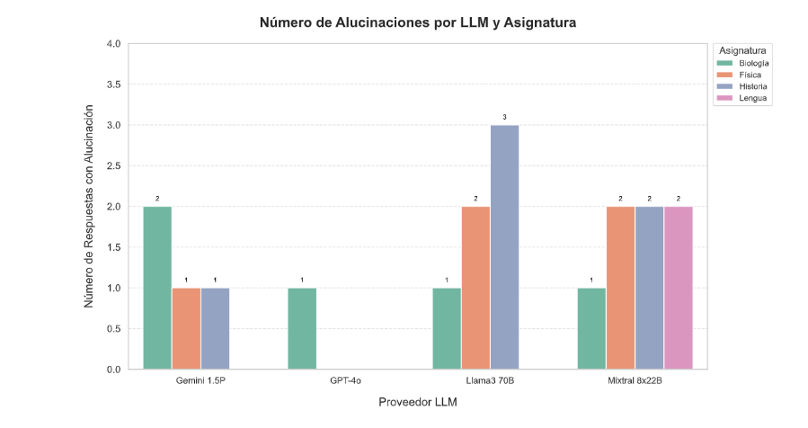
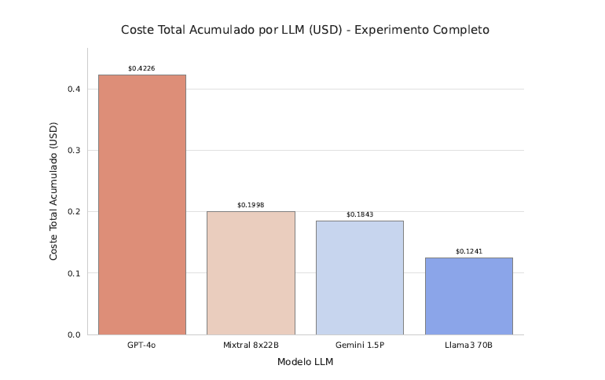

# High-Precision RAG System for Academic & Technical Documents

**Autor:** Pablo Antonio García Pastor  
**Proyecto de Trabajo de Fin de Máster (TFM)** en Inteligencia Artificial

[](https://www.python.org/downloads/)
[](https://streamlit.io/)
[](https://opensource.org/licenses/MIT)

---
<p align="center">
  
</p>

---

## 1. Resumen del Proyecto

Este repositorio es la culminación de un Trabajo de Fin de Máster (TFM) y representa un ecosistema completo para la **Generación Aumentada por Recuperación (RAG) de alta precisión**. Contiene dos componentes interconectados:

1.  **La Investigación (`/research_TFM`):** Un **benchmark académico** riguroso que evalúa y compara el rendimiento, coste y fiabilidad de cuatro LLMs de vanguardia (GPT-4o, Gemini 1.5 Pro, Mixtral 8x22B, Llama 3.1 70B). Esta investigación fundamenta las decisiones de diseño del sistema.
2.  **La Aplicación (`/app`):** Un **asistente de chat multi-documento** funcional y pulido, construido con Streamlit. Es la implementación práctica y refinada del sistema RAG que fue diseñado y validado durante la fase de investigación.

En esencia, este proyecto no solo presenta una herramienta de software avanzada, sino también toda la **investigación metodológica** que la respalda, ofreciendo una visión de 360 grados desde la teoría hasta la práctica.

---

## 2. La Aplicación: Asistente RAG Multi-Documento

La carpeta `/app` contiene un sistema RAG listo para usar, diseñado para convertir documentos densos (académicos, legales, técnicos) en asistentes de chat expertos.

### ▶️ Cómo Ejecutar la Aplicación
```bash
# (Asegúrate de haber completado la instalación general más abajo)

# Ejecuta la aplicación Streamlit desde la raíz del proyecto
streamlit run app/app.py
```
La aplicación se abrirá en tu navegador, donde podrás seleccionar un PDF, construir su índice si es necesario, y comenzar a chatear.

### ✨ Características de la Aplicación
-   **Interfaz Web Interactiva**: Construida con Streamlit para una experiencia de usuario fluida.
-   **Soporte Multi-Documento**: Permite seleccionar y conversar con múltiples PDFs de forma aislada.
-   **Gestión Inteligente de Índices**: Detecta automáticamente si un documento necesita ser indexado o si su contenido ha cambiado.
-   **Trazabilidad y Transparencia**: Muestra los fragmentos de texto exactos (fuentes) utilizados para generar cada respuesta, garantizando la fiabilidad.

---

## 3. La Investigación: TFM Benchmark de LLMs en RAG

La carpeta `/research_TFM` contiene todo el material relacionado con el TFM, incluyendo el documento completo, el código de los experimentos, los datos de evaluación y los resultados.

### Metodología y Evaluación
El estudio se basó en un pipeline RAG avanzado para realizar un benchmark sistemático. Se evaluaron **72 tareas** (18 por asignatura) en cuatro áreas (Biología, Física, Historia, Lengua y Literatura) y tres tipos de actividades (Síntesis, Generación de Preguntas, Q&A).

#### Métricas Cualitativas
Cada una de las 72 respuestas por modelo fue evaluada manualmente por un experto en una escala de 1 a 5 en las siguientes dimensiones:
-   **Exactitud Factual**: Veracidad de la información y ausencia de alucinaciones.
-   **Calidad de Síntesis**: Capacidad de condensar información manteniendo las ideas clave.
-   **Coherencia Narrativa**: Estructura lógica, fluidez y cohesión del texto.
-   **Corrección Gramatical y Estilo**: Adecuación al estilo académico formal.

#### Métricas Cuantitativas
-   **Coste Económico**: Estimación del coste en USD por el uso de las APIs.
-   **Eficiencia Temporal**: Medición de la latencia total (recuperación + inferencia del LLM).

### Visualización de Resultados Clave
A continuación se presentan algunos de los gráficos más representativos del TFM:

**Figura 7.1: Puntuación Cualitativa General Promedio por LLM y Asignatura**
*Rendimiento general de cada modelo en los diferentes dominios temáticos, evidenciando su consistencia.*


**Figura 7.2: Número Total de Alucinaciones por LLM y Asignatura**
*Incidencia de alucinaciones (generación de información incorrecta) para cada modelo, una métrica clave de fiabilidad.*


**Figura 7.3: Coste Total Acumulado del Experimento (USD)**
*Coste económico total para ejecutar las 72 tareas con cada modelo, destacando la eficiencia de los modelos de código abierto.*


### Conclusiones de la Investigación
-   **GPT-4o**: El **líder en calidad y fiabilidad**, ideal si el rendimiento es crítico y el coste secundario.
-   **Gemini 1.5 Pro**: La opción más **equilibrada**, combinando alta calidad con un coste moderado.
-   **Mixtral 8x22B Instruct**: Un modelo **sólido pero con mayor variabilidad** y tendencia a complementar el contexto con conocimiento externo.
-   **Llama 3.1 70B Instruct**: La opción más **rápida y económica**, aunque con menor calidad y fiabilidad en el contenido.

Para un análisis en profundidad, consulta el documento `research_TFM/TFM_Pablo_Garcia_Pastor.pdf`.

---

## 4. Arquitectura Técnica del Sistema RAG

El corazón de ambos proyectos es un pipeline de recuperación de vanguardia diseñado para la máxima precisión:

-   **Procesamiento Avanzado de PDF**: Utiliza heurísticas para filtrar páginas irrelevantes (portadas, índices) y detectar contenido estructurado (LaTeX, fórmulas).
-   **Búsqueda Híbrida**: Combina la búsqueda semántica (FAISS) para la comprensión conceptual con la búsqueda por palabras clave (BM25) para la precisión terminológica.
-   **Ponderación Dinámica**: Analiza la **intención** de la pregunta para ajustar en tiempo real la importancia de cada motor de búsqueda.
-   **Re-ranking (Reordenamiento)**: Emplea un modelo Cross-Encoder (`ms-marco-MiniLM-L-12-v2`) para re-evaluar los resultados y garantizar que el contexto final sea de la más alta relevancia.
-   **"Dynamic K"**: Selecciona de forma inteligente el número de fragmentos de contexto a enviar al LLM basándose en su puntuación de relevancia, evitando el ruido.

---

## 5. Instalación y Uso General

**1. Clonar el Repositorio:**
```bash
git clone https://github.com/pablotgp/High-Precision-RAG-System.git
cd High-Precision-RAG-System
```

**2. Crear y Activar un Entorno Virtual (Recomendado con Anaconda):**
```bash
# Crear el entorno con Python 3.9
conda create -n rag_env python=3.9 -y

# Activar el entorno
conda activate rag_env
```

**3. Instalar Dependencias:**
*(Este archivo contiene las dependencias para AMBOS subproyectos)*
```bash
pip install -r requirements.txt
```

**4. Configurar Variables de Entorno:**
Crea un archivo `.env` en la raíz del proyecto (puedes usar `app/src/.env_example` como plantilla) y añade tus claves de API.

---

## 6. Estructura del Repositorio

```
High-Precision-RAG-System/
│
├── App/                          # Contenido de la aplicación Streamlit.
│   ├── data/                     # Documentos PDF para usar en la aplicación.
│   ├── index/                    # Índices vectoriales generados por la aplicación.
│   ├── src/                      # Lógica del backend RAG (procesamiento, retrieval, etc.).
│   ├── .env_example              # Plantilla para las variables de entorno de la app.
│   ├── app.py                    # Punto de entrada para la interfaz web con Streamlit.
│   └── main.py                   # Interfaz de línea de comandos (CLI) para la app.
│
├── Research_TFM/                 # Material completo del Trabajo de Fin de Máster.
│   ├── assets/                   # Gráficos y visualizaciones para el README.
│   ├── data/                     # Corpus de documentos PDF utilizado en la investigación.
│   ├── evaluation_datasets/      # Contiene la evaluación CUALITATIVA MANUAL (puntuaciones).
│   └── TFM.pdf                   # Documento completo de la investigación (.pdf).
│
├── .gitignore                    # Archivos y carpetas a ignorar por Git.
├── README.md                     # Este archivo.
└── requirements.txt              # Dependencias de Python para todo el proyecto.
```
